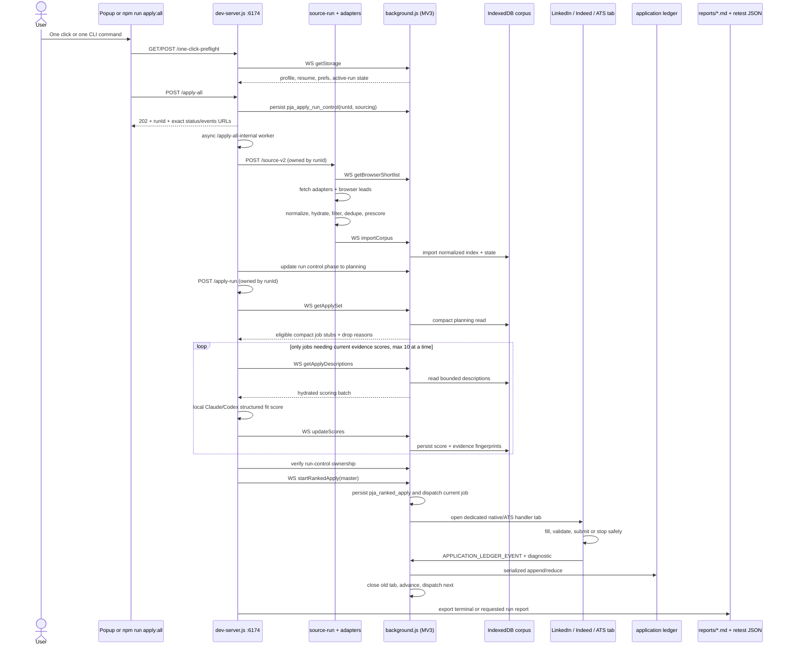
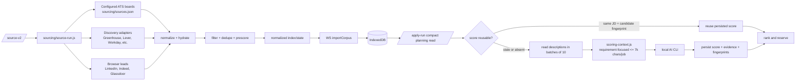
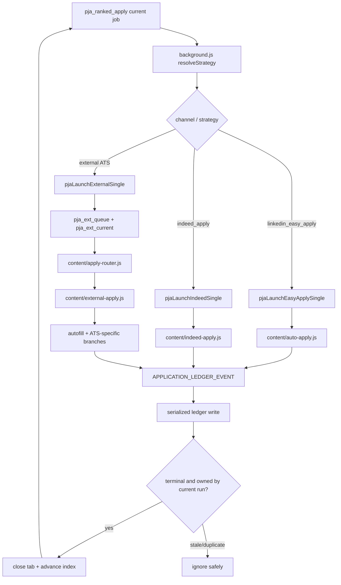

# Architecture: one action to sourced, ranked, and applied jobs

This is the authoritative project map. It describes the current code, not the older target-state
plans. Start here when changing orchestration, sourcing, scoring, storage, routing, or diagnostics.

## Mental model

The system has three runtimes:

1. **Extension UI/content runtime** — popup, settings, shortlist, and content scripts.
2. **MV3 service worker** — owns durable browser-side orchestration, tabs, storage, IndexedDB, the
   application ledger, and the ranked-run watchdog.
3. **Local dev server** — owns HTTP/CLI entry points, sourcing adapters, AI calls, planning, and
   developer report generation. It communicates with the service worker over WebSocket.

The source of truth for jobs is IndexedDB. Before queue installation, the source of truth for an
admitted batch is `pja_apply_run_control`; after ownership-safe handoff, it is `pja_ranked_apply`.
The source of truth for outcomes is `pja_application_ledger` plus the compact completed-run snapshot.
`pja_ext_queue` and the native-channel queues are per-handler transport state, not the global
orchestrator. The editable overview is
[One-click Apply Architecture v3](https://www.figma.com/board/1g3FrLoyCT5z5KB4vTgiFW).

## End-to-end one-click sequence

Both primary entry points converge on `/apply-all`:

- Popup: `popup/popup.js` → `/one-click-preflight` → `/apply-all`.
- CLI: `scripts/pja-apply-all.js` → `/one-click-preflight` → `/apply-all`.
- Shortlist has a review-oriented alternate launcher, but it still calls `/apply-all`.

Do not implement a new “apply N jobs” path around `/start-ea`; that endpoint is deliberately
LinkedIn-only and is not the unified product flow.

### Exact-run observation contract

`/apply-all` allocates and durably persists the `runId` before returning HTTP 202 with run-specific
status/events URLs. Sourcing and planning then continue asynchronously through
`/apply-all-internal`. The durable control record makes pre-queue progress observable and prevents
a caller/network timeout from losing the run identity. Immediately before queue installation,
`/apply-run` verifies that the worker still owns the same planning record; a timed-out or failed
worker therefore cannot install a late orphan queue.
Internal `/source-v2` and `/apply-run` calls use `local-json-client.js`, whose explicit request
timeout covers the complete response rather than inheriting Node fetch's shorter implicit header
timeout. Transport failures identify the endpoint and configured duration.

`GET /apply-runs/:runId` never falls back to another latest run; unknown IDs return 404. The shared
pure modules are:

- `apply-run-state.js` — versioned compact state, transition/health enums, ownership-safe reducer.
- `apply-run-control.js` — pure pre-queue creation, freshness, and late-worker ownership rules.
- `local-json-client.js` — explicit-timeout loopback transport for long source/plan workers.
- `scoring-frontier.js` — cached-score reuse and token-bounded advancement into unscored candidates.
- `apply-progress.js` — exact-run snapshot and bounded transition events from queue/ledger state.
- `apply-recovery-policy.js` — deterministic wait/inspect/resume/stop/report actions.

`npm run apply:all -- --target N --category C --wait` follows the returned ID through terminal
state and exports its report. `npm run apply:watch -- --run-id ID` resumes that observation in a new
session. A compact gitignored `.pja-run.local.json` stores only the last followed ID/status; browser
storage and the ledger remain authoritative. The watcher tolerates at most two transient 404s while
the service worker changes tabs, then fails with the ownership/missing-run exit code; it never
substitutes a latest or different run.

Category runs isolate both channel and strategy and use a run-scoped confirmed target, so one
category's confirmations cannot satisfy another category. Their default evidence-scoring window is
20 candidates (or four times the requested coverage/attempt reserve, whichever is larger); callers
may raise `scoreCandidateLimit` explicitly after a supply-limited report. Cached scores whose JD and
candidate fingerprints still match never consume that new-score budget, so later runs advance into
previously deferred candidates.

## Sourcing and scoring flow

Key rules:

- `sourcing/source-run.js` is the current sourcing orchestrator for `/source-v2`.
- `idb-store.js` is the browser-side corpus store. Descriptions stay in IndexedDB and are fetched
  only for the scoring batch that needs them.
- Scores are reusable only when both the posting-description fingerprint and candidate fingerprint
  match. This prevents stale resume/JD evidence from driving autonomous submission.
- A high score is not enough: the apply gate also checks direct evidence, conflicts, confidence,
  status, attempts, blocked tenants, location, per-company caps, and prior applications.
- Planning drops are expected output. Every rejected candidate should have a deterministic reason.

## Ranked apply dispatch

The router is real, but external strategy handlers are currently registrations of the same large
`runExternalApply` engine. The strategy boundary exists; most ATS implementations have not yet been
extracted into independent files.

## Module map

| Area | Current production modules | Responsibility |
| --- | --- | --- |
| Entry | `popup/popup.js`, `scripts/pja-apply-all.js`, `shortlist/shortlist.js` | Start/preflight/status/report surfaces. |
| HTTP/AI | `dev-server.js`, `ai-cli.js`, `scoring-context.js` | Endpoints, source/apply planning, bounded local model calls, report generation. |
| Sourcing | `sourcing/source-run.js`, `sourcing/adapters/*`, `browser-import.js`, `filter.js`, `dedupe.js`, `jobstore.js` | Build normalized, hydrated, candidate-relevant corpus. |
| Browser store | `idb-store.js` | Description-rich IndexedDB corpus and compact planning reads. |
| Orchestrator | `background.js` | WS bridge, storage guards, ranked queue, tab dispatch, CDP, watchdog, ledger serialization. |
| Routing policy | `sourcing/detect-ats.js`, `sourcing/apply-select.js`, `content/apply-router.js` | ATS identification, apply eligibility/state mapping, executable strategy selection. |
| Form filling | `content/autofill.js`, `fiber-main.js` | Field classification and native/React/Fiber-controlled commits. |
| Native channels | `content/auto-apply.js`, `content/indeed-apply.js` | LinkedIn Easy Apply and Indeed Apply state machines. |
| External ATS | `content/external-apply.js`, `workday-auth.js`, `workday-engine.js`, `apply-account.js` | External form execution, Workday auth, recovery, terminal diagnostics. |
| Evidence | `application-ledger.js`, `confirmation-tracker.js` | Outcome reduction/audit and optional email reconciliation. |
| UI | `content/content.js`, `popup/*`, `shortlist/*`, `settings/*` | Sidebar, pipeline/review UI, local profile/resume/answers. |

## Storage and ownership

| State | Owner | Meaning |
| --- | --- | --- |
| IndexedDB `jobs`/`jobState` | `idb-store.js` through service worker | Canonical sourced postings, descriptions, fit evidence, attempts, and state. |
| `pja_apply_run_control` | `dev-server.js`, acknowledged by `background.js` | Compact durable pre-queue lifecycle (`preflight`/`sourcing`/`planning`) and terminal admission/planning failure. Also acts as the late-worker ownership token. |
| `pja_ranked_apply` | `background.js` | One global ranked run, current index, in-flight tab, results, planning drops. |
| `pja_application_ledger` | serialized writer in `background.js` | Evidence-bearing outcome events; used for confirmed counts and idempotency. |
| `pja_last_completed_apply_run` | `background.js` | Compact terminal snapshot retained after the active run changes. |
| `pja_ext_queue` / `pja_ext_current` | external launcher + `external-apply.js` | One external job transport queue for the current ranked reserve. |
| `pja_indeed_queue` | Indeed launcher/engine | Indeed handler-local state. |
| session `pja_apply_queue` | LinkedIn launcher/engine | LinkedIn handler-local state. |
| `pja_profile`, `pja_prefs`, `pja_answers`, resume keys | Settings UI; guarded writes in service worker | Private candidate facts and reusable answers. Never commit. |
| `pja_apply_diagnostics`, `pja_last_apply_failure`, `pja_dbg` | content handlers | Sanitized failure evidence and bounded step logs. |

Every terminal result must carry a `runId` and stable job identity. Content scripts may finish late
after a watchdog or recovered tab has advanced; ownership checks prevent those stale results from
mutating the next job.

## Loaded, reachable, shadow, and historical code

These classifications are important when deciding whether a file can be removed.

| Module/path | Status | Evidence / action |
| --- | --- | --- |
| `content/apply-preflight.js` | **Active shared policy** | Injected before `external-apply.js`; production delegates stable dead-posting and chatbot decisions to `window.PJAPreflight`. Fill verification/success helpers remain pure seams for later incremental adoption. |
| `cdp-selfheal.js` | **Active shared policy** | UMD module loaded by the service worker and imported by unit tests. `background.js` owns browser actions but delegates ladder decisions to this module. |
| `sourcing/router.js` | **Removed legacy seam** | No production loader imported it, so the test-only duplicate router was removed. Corpus eligibility lives in `sourcing/apply-select.js`; execution routing lives in `content/apply-router.js`. |
| `sourcing/pipeline.js` + `/source` | **Reachable legacy path** | `/source` can still source/review, but queue launch is forced off. Unified one-click uses `/source-v2` + `/apply-run`. Keep only for compatibility or deprecate explicitly. |
| `/start-ea`, `/start-indeed-apply`, `/start-scan` | **Reachable alternate tools** | Useful targeted/manual endpoints; not part of the unified entry path. |
| `confirmation-tracker.js` | **Reachable admin path** | Used by `/reconcile`, not by every run automatically. The application ledger remains primary evidence. |
| `content/gmail-verify.js` | **Dynamically loaded** | Not a manifest content script. The service worker injects it into a Gmail tab during verification. Do not classify it as dead. |
| `content/fiber-main.js` | **Manifest MAIN-world bridge** | Loaded separately at `document_start`; enables React-select state commits inaccessible from the isolated content world. |
| `create_icons.py` | **Developer utility** | Not runtime code. Retain only while icons may be regenerated. |
| dated `E2E_*`, `APPLY_SESSION_LOG.md`, plan documents | **Historical evidence/plans** | Useful regression context, not authoritative architecture. This file and `PROJECT_GOAL.md` win when they conflict. |
| `reports/` | **Generated and gitignored** | Local sanitized run artifacts and retest manifests. Never treat them as committed product state. |

## Load-bearing invariants

- Never rename existing `pja_*` keys without a migration.
- The service worker is the sole serialized writer for the application ledger.
- Only explicit page/email evidence counts as confirmed. A click, navigation, or vanished form alone
  is not confirmation.
- Never fabricate profile, qualification, legal, work-authorization, citizenship, or export-control
  answers. Missing facts become `needs_manual`/missing-question diagnostics.
- CAPTCHA, anti-bot, and account locks are terminal/manual states, not bypass targets.
- React-controlled fields must use native setters/events, Fiber callbacks, or trusted CDP paths.
- `runId`/job ownership checks must remain around result writes and queue advancement.
- Planning and active-run storage stay compact; descriptions belong in IndexedDB.
- Rule ordering in `PJA_FIELD_RULES` is semantic and must stay most-specific first.

## Highest-value seams for future refactoring

1. Extract one ATS at a time from `external-apply.js` behind `PJAApplyRouter.registerHandler`, keeping
   the existing result/diagnostic contract.
2. Split `dev-server.js` by endpoint family only after adding handler-level tests; it currently mixes
   HTTP transport, sourcing, scoring, planning, control endpoints, and reports.
3. Continue moving stable preflight/success decisions into `apply-preflight.js` one at a time, with production-usage regression tests.
4. Standardize bounded structured debug events. `pja_dbg` currently contains useful but inconsistent
   strings from several modules.

Use `npm run context -- <overview|apply|sourcing|ai|storage|logs|ui>` before opening code. It prints
the smallest relevant file and test set for a new session.
