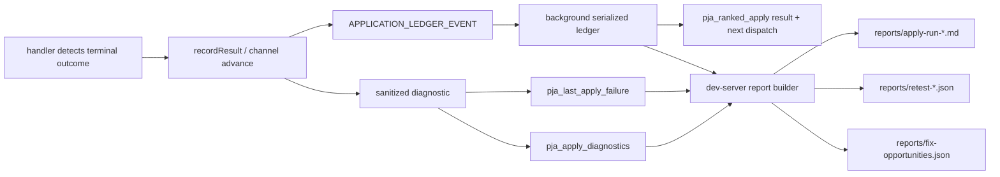

# Apply observability and failure-fix workflow

The product is successful only when every selected job ends in a defensible outcome and failures
contain enough sanitized evidence to improve the correct module.

## Outcome contract

Every planned job must become one of:

- **confirmed** — explicit page or uniquely matched email evidence.
- **submitted/unverified** — submit evidence exists, but acceptance is not confirmed.
- **failed** — automation attempted and reached a terminal code/field/navigation failure.
- **skipped/manual** — deterministic safety or external blocker such as CAPTCHA, missing facts,
  unsupported strategy, prior application, or account lock.
- **planning drop** — never launched, with a reason such as score/evidence/location/status/route gate.

A click, redirect, missing form, or `_handled` flag alone must never become confirmed.
Submitted/unverified is also non-auto-retryable: it remains visible for manual reconciliation so a
missing confirmation cannot turn into a duplicate application after a sourcing refresh.

## Evidence path



External ATS diagnostics include, when available:

- `runId`, job identity, company/title, channel, ATS/strategy, apply URL, current URL and hostname.
- phase and normalized reason.
- unresolved required labels, visible errors, control counts, submit-button labels, radio groups.
- bounded recovery history and recent step log.
- timestamps and application start time.

PII is redacted or omitted. Values typed into text inputs are not persisted as DOM diagnostic text.
Screenshots are bounded and used only for a live recovery request; the full image is not written into
the failure snapshot.

## Triage commands

```bash
npm run apply:status
npm run apply:status -- --run-id apply-...
npm run apply:watch -- --run-id apply-...
npm run apply:report
curl http://localhost:6174/inspect-apply
curl -X POST http://localhost:6174/corpus-status -H 'Content-Type: application/json' -d '{}'
```

Generated reports are local and gitignored. Start with the newest run report, then inspect only the
cluster/retest rows relevant to the reason being fixed.

For automation and handoff, prefer `GET /apply-runs/:runId` and its bounded `/events` endpoint over
raw logs or latest-run inference. Public progress includes phase, category, counts, current compact
job identity, seconds since the last meaningful transition, health, and next action; it excludes
profile values, descriptions, HTML, and form values.

Exact-run observation uses a service-worker-produced compact snapshot. HTTP 404 means the extension
answered and the requested ID was absent; HTTP 503 `application_run_state_unavailable` means the
observer did not answer and is retryable. A watcher must retain the same runId across that 503 and
must not admit a replacement run.

`GET /health` reports both `clients` and `extensionResponsive`. A connected socket with
`extensionResponsive:false` is not sufficient for live-run admission; `extensionBuild` identifies
the worker command contract currently loaded.

The exact-run endpoint is valid as soon as `/apply-all` returns: before a browser queue exists it
reads the acknowledged `pja_apply_run_control` record and reports `sourcing` or `planning`. If that
worker fails or times out, the same run becomes terminal `failed` and retains a bounded error;
there must never be a later unowned queue installation for that ID.
If planning ends with `nothing eligible`, the same control record retains compact planning-drop
totals/reason counts and bounded sanitized examples so the exact-run report remains auditable without
a ranked queue.
Loopback transport errors name the internal endpoint and explicit timeout. The bare message
`fetch failed` is not an acceptable terminal diagnostic because it hides Node's transport cause.

Exact sourcing reports terminalize ownership and deadline failures distinctly:
`source_ownership_lost`, `sourcing_deadline_exceeded`, and `extension_disconnected`. Browser
discovery stops scheduling at those boundaries. Even if an already-open search tab finishes late,
the service worker rechecks the same run-control token and deadline immediately before IndexedDB
import, so the stale operation cannot import or retire corpus rows.

`/source-v2` reports a sanitized `quality` object for every run: known/unknown posting freshness,
7/30-day freshness counts, full-description coverage, supported-ATS coverage, deduplication merges,
prior-application exclusions, and heuristic-priority candidates. Heuristic priority must never be
reported as genuine fit. Description misses include at most 12 description-free job examples for
adapter triage. The `import` object additionally reports newly sourced, newly hydrated,
description-updated, unchanged, evidence-preserved, and retired row counts when `write` is enabled.
The `searchPolicy` object records the bounded query list, derived/explicit seniority band, and saved,
level-variant, and adjacent query counts. `/supply-audit` reports the same band beside corpus and
below-threshold seniority counts so discovery policy and bottleneck diagnosis cannot drift.
Workday and SmartRecruiters detail misses carry normalized hydration statuses/reasons (`hydration_timeout`,
`hydration_http_error`, `hydration_fetch_error`, or missing detail/payload) without response bodies.

Browser funnel reports use precise stage names: `discovered` means a DOM card with observable
platform presence; it is not persistence. Each page reports platform count, DOM observations,
stable IDs, deterministic acceptance, batches sent/acknowledged, inserted/enriched/refreshed,
filtered/rejected with reasons, direct routes, and the continuation/stop reason. Cumulative coverage
separately reports `persistenceAcknowledged`. Normalization, freshness retention, duplicate merges,
destination resolution, hydration, evidence scoring, qualification, and planning drops are reported
by `/source-v2` and the dry apply plan; none may be described as “captured” merely because a card was
seen. `pja_source_yield` retains a bounded rolling source/query/page history for future scheduling.
Scheduling uses acknowledged `unique` and `persisted` yield; duplicate-only page-one volume must not
outrank a query family that repeatedly contributes new persistent records.

Browser enrichment exposes `completed`, `resolved`, and `hydrated`; official resolution also reports
`resolved`, `ambiguous`, `noMatch`, and `identityMismatch`. Hydration outcomes stay explicit
(`hydration_success`, `hydration_missing`, `hydration_timeout`, `hydration_identity_mismatch`, or
`hydration_source_blocked`). Progressive dry planning reports AI round size, model-batch count,
qualified yield, remaining frontier, and its stop reason. It also reports `scoringPolicyVersion` and
bounded `scoringEvidenceSummary` counts for direct/adjacent/stretch transferability and
material/trainable/preferred gaps; it never emits resume or JD text in that summary. A legacy score
appears as `scoring_policy_mismatch` until the bounded frontier produces current structured evidence.

## Reason-to-owner map

| Failure family | Primary owner |
| --- | --- |
| `rescore_*`, weak evidence, conflicts, missing descriptions | `scoring-context.js`, score gate, source hydration/adapters; compare `/source-v2.report.quality.descriptions` and `.import.newlyHydrated` before spending more frontier budget |
| no route / unsupported strategy / wrong ATS | `detect-ats.js`, `apply-router.js`, `apply-select.js` |
| missing required / select / radio / combobox | `autofill.js`, then the ATS-specific branch |
| Workday auth/account/verification | `workday-auth.js`, `workday-engine.js`, Workday branch in external engine; marked duplicate-record draft retries terminalize before refill as `workday_duplicate_record` |
| `no_apply_path`, `apply_btn_no_form`, dead posting | source apply URL, router signals, external preflight/navigation branch |
| `submit_unclear`, unverified confirmation | channel submit detector, `application-ledger.js`, confirmation rules |
| `submit_observation_timeout`, `workday_transport_failure`, ambiguous historical `ranked_watchdog_timeout` | manual reconciliation; shared `ledger-retry-policy.js` blocks automatic retry and drives the developer blocked summary |
| `trusted_click_failed` | LinkedIn CDP transport (`background.js`); diagnostic includes the exact modal heading and action |
| LinkedIn `stuck` | `content/auto-apply.js`; terminal only after contact-control blur settle (never dialog-level Escape), trusted mouse, and one trusted-keyboard recovery; the ledger diagnostic includes populated/invalid controls, action disabled state, CDP transport, DOM landing acknowledgement, and bounded hit-target metadata |
| `stuck_watchdog`, handler timeout | handler lifecycle first; watchdog only reports/advances |
| CAPTCHA, daily limit, checkpoint, account lock | external-service/manual blocker; do not attempt bypass code |

## Fix loop

1. Export the run report and select one repeated failure cluster.
2. Confirm the event belongs to the active `runId` and job; discard stale-tab noise.
3. Use the diagnostic phase, missing labels, controls, and recovery log to identify one owning
   function/module.
4. Add a pure or fixture-based regression test reproducing that evidence shape.
5. Implement the smallest handler/rule change.
6. Run unit tests, full tests, and dry-run planning.
7. Use the generated retest manifest for a bounded stop-before-submit browser retest.
8. Only run real submission when intentionally authorized; never use production applications as a
   general smoke-test suite.

## Logging rules for new code

- Include `runId`, stable job identity, channel/strategy, phase, and normalized reason.
- Keep arrays and strings bounded; prefer counts plus a few examples.
- Never log passwords, resume data URLs/text, verification codes, full Gmail content, API keys, or
  arbitrary form values.
- Record terminal outcomes once. Late recovered tabs must pass ownership checks before writing.
- A new failure reason must map through apply-state selection and report grouping; otherwise it can
  become an unexplained retry loop.
- Log external blockers as terminal/manual evidence, then advance. Do not hide them as generic
  `unknown` or burn the watchdog budget repeatedly.
